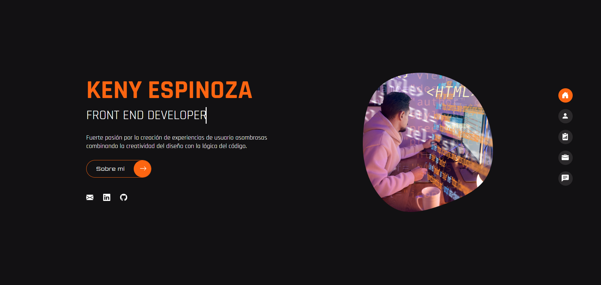

  
  

# Portafolio | Keny Espinoza Luis   
 

Con mucha creatividad y dedicación, presento con orgullo mi proyecto de portafolio. Este espacio virtual es más que una colección de trabajos; es el testimonio visual de horas de esfuerzo, superación de desafíos y mi pasión como desarrollador Front end.

Cada elemento en este portafolio cuenta una historia, no solo de éxitos visuales, sino de las lecciones aprendidas en el camino. Cada desafío superado ha dejado una huella, y cada solución creativa es una prueba de mi compromiso con la excelencia.

👨‍💻Herramientas: 

**Front End:**
  - Html 5
  - Css 
  - Sass
  - JavaScript
  - React
  - Vite

  

**Back End:**
  - NodeJS
  - Express
  - Nodemailer

  

